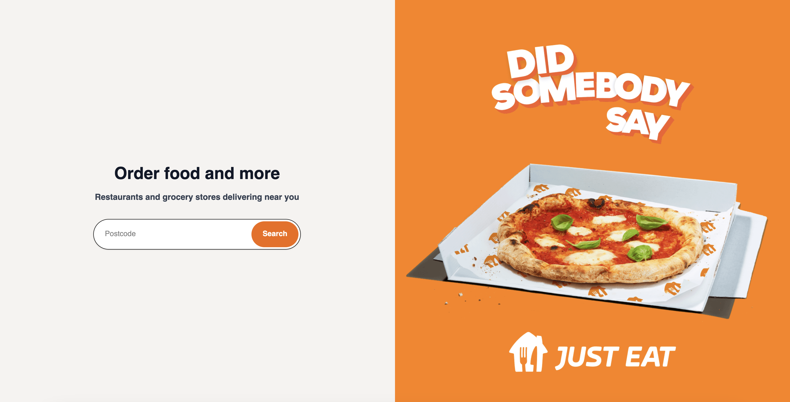
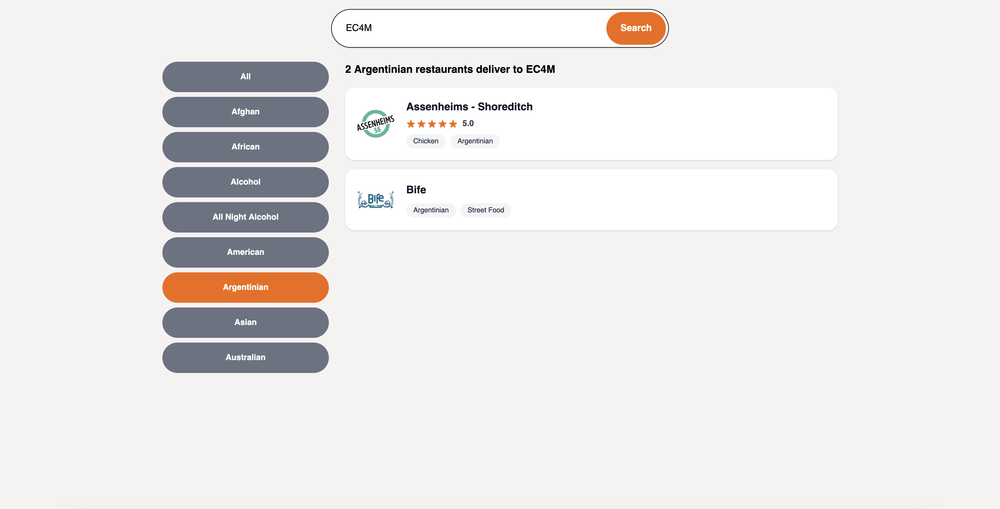

# 🍽️ Just Eat Postcode Search

This project is a front-end proof of concept for a postcode-based restaurant search using the public Just Eat API.

## 🚀 Overview

-   ✅ Vue 3 with the Composition API and TypeScript
-   ✅ Postcode search with Just Eat API integration
-   ✅ Accessible and responsive UI
-   ✅ Modular component structure
-   ✅ Infinite scroll and single-select cuisine filters
-   ✅ Spinner, loading states, and no-results handling
-   ✅ Unit + Cypress end-to-end tests with fixture mocking

## 🖼️ Preview

<div style="display: flex; gap: 16px;">
  <div style="text-align: center;">
    <p><strong>Landing Page</strong></p>
    
  </div>
  <div style="text-align: center;">
    <p><strong>Search Results Page</strong></p>
    
  </div>
</div>

## 🧩 Component Structure

The UI is broken down into small, reusable, and accessible components:

-   **PostcodeSearchBox.vue** - Handles postcode input and submission
-   **Button.vue** - A flexible and accessible button component
-   **Input.vue** - Reusable input with optional uppercase formatting
-   **CuisineFilter.vue** - Vertical filter menu supporting selection and keyboard accessibility
-   **RestaurantCard.vue** - Displays restaurant info including logo, cuisines, and rating
-   **StarRating.vue** - Renders visual star ratings using SVG, rounded to nearest full star
-   **InfiniteList.vue** - Generic infinite scroll utility with observer-based pagination
-   **Spinner.vue** - Indicates loading state
-   **NoResults.vue** - Friendly fallback message when no results are found

## 🔎 Search Flow

-   Landing page shows a hero image and postcode search box
-   Search submission navigates to /search?postcode=XX
-   Results are fetched and rendered with infinite scroll
-   Optional filters let users refine by cuisine
-   No results display a clear and accessible message

## 🧪 Testing

✅ Unit Tests

-   API response transformation logic (transform.ts)
-   Error handling (400, 404, 429, 500, network errors)
-   Cuisine extraction and alphabetical sorting

✅ Cypress End-to-End Tests

Using a mocked ec4m.json fixture:

-   Displays search results for EC4M
-   Filters by cuisine (e.g., Burgers -> 252)
-   Displays no results message when no matches
-   URL updates reflect query string state

Fixture mocking ensures tests run fast and reliably without real API calls.

## ⚙️ API Handling & Considerations

-   API calls are made via Axios with a shared client
-   Errors are mapped to user-friendly messages
-   Edge cases like empty restaurants, unknown postcodes, and rate-limiting (429) are handled
-   transformRestaurant() ensures only the required fields are exposed

## 🤔 API Feedback

The Just Eat API is functional but could be improved:

-   Support for pagination or limit/offset would improve scalability. The result for EC4M is nearly 5MB
-   Support filtering directly via query params such as ?cuisine=Pizza to avoid manual filtering client-side

## 🔮 Future Improvements

-   Replace the toast notification for API errors with a more consistent, accessible, and user-friendly error display component
-   Improve test coverage across unit, end-to-end, and component levels
-   Implement debouncing or throttling for searches to reduce load and help mitigate rate-limiting (429)
-   Implement caching for repeated postcodes
-   Introduce skeleton loaders while fetching restaurant data
-   Improve mobile responsiveness
-   Review and improve accessibility

## 🚀 To Run Locally

```bash
npm run dev
```

Then visit http://localhost:5173

## 🧪 To Run Tests

```bash
npm run test # Run unit tests with Vitest
npx cypress open # Run end-to-end tests with Cypress
```

## 🤝 Questions Welcome

I'm happy to walk through any part of the code, testing, or decisions. Thank you!
